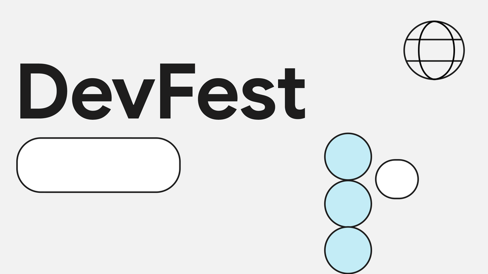
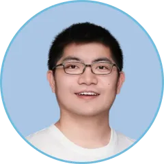
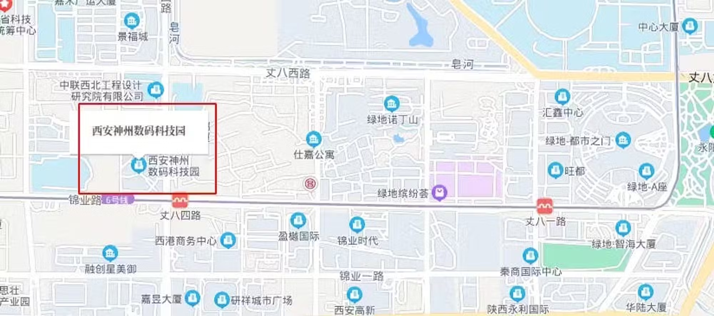

# GDG Xi'an DevFest 2024 报名 | GDG 西安

GDG DevFest 是由 Google Developer Groups（GDG）社区组织的一年一度的大型开发者节日。这是一个面向开发者、技术爱好者和创新者的活动，旨在提供学习、分享和交流的平台。在 GDG DevFest 上，参与者可以了解到最新的技术趋势，听取行业专家的深度演讲，参加实践工作坊，并与同行进行线上和面对面的交流。DevFest 覆盖了多种技术主题，包括 Android、Web、Cloud、AI 和 Machine Learning 等，是提升个人技术技能和扩展职业人脉的绝佳场合。

GDG Xi'an 社区本年度 DevFest 我们邀请了三位 Google Developer Experts (GDE) 为大家带来了大模型，Android 和 Firebase 相关的话题，欢迎大家踊跃报名前来学习和交流。

## 活动话题

### 大语言模型结合企业知识库的私有化部署：技术架构与实践

随着人工智能技术的快速发展，大语言模型（LLM）在企业中的应用日益广泛。然而，公有化部署的模型在数据安全性、合规性以及特定领域知识回答方面存在局限。私有化部署能够提供更高的数据安全性和合规性，同时允许企业根据自身需求定制化模型，提高模型的有效性和准确性。

> **分享嘉宾：黄鸿波**，深圳市鼎盛方圆科技发展有限公司创始人，中国43个谷歌机器学习方向开发者专家之一，前西山居AI技术专家，2018年出版《TensorFlow进阶指南：基础、算法与应用》一书。
> 
> 

### Firebase在安卓中的应用

探讨 Firebase 在安卓开发中的实际应用，分析其核心功能的集成与实现，帮助开发者更好地理解并使用 Firebase 提供的服务。

> **分享嘉宾：张海龙**，花房集团移动端资深工程师，Firebase GDE，CSDN博主，有丰富的海外项目经验。
> 
> 

### Android 性能优化 - 面试经典问题及官方新工具介绍

用户体验是移动应用始终关注的话题，Google Android 团队持续不断地推出性能优化技术方案，是否熟练掌握这些方案很大程度影响了 Android 程序员面试的结果。本次分享一起来聊聊面试中常见的性能优化问题和官方的新工具，相信会让听众对性能优化有进一步的认识。

> **分享嘉宾：张世欣**，Android GDE & 《Android 性能优化入门与实战》书籍作者。
> 
> 

## 活动时间

2024年11月24日 周日 13:30 - 18:00

## 活动议程

13:30 - 14:00  活动签到  
14:00 - 15:00  大语言模型结合企业知识库的私有化部署：技术架构与实践  
15:00 - 15:10  合影  
15:10 - 16:10  Firebase在安卓中的应用  
16:10 - 16:20  茶歇  
16:20 - 17:20  Android 性能优化 - 面试经典问题及官方新工具介绍  
17:20 - 18:00  互动问答，交流学习

## 活动地点

丈八四路20号，西安神州数码科技园4栋一楼大厅电梯间南侧会议室。（地铁六号线，丈八四路站A口出）

**感谢泥巴创客空间提供免费场地**

## 报名方式

GDG 西安的活动均为免费活动，任何对开发感兴趣的朋友，都欢迎报名参加。

<https://jinshuju.net/f/QTjxjS>

**感谢金数据提供免费高级表单**

## 主办方

活动由GDG西安主办，GDG西安成立于2012年8月4日，是一个专注于 Google 开发技术、开源技术的技术社区。我们讨论的技术有 Android, Dart, Angular, Cloud Computing 等，开源技术一直是我们的最爱。

GDG西安是根植于西安的软件开发者社区，是 Google Developer Group Xi'an 的缩写，是谷歌开发者社区全球大家庭的一分子。我们每月会举行一次线下的开发者聚会，至2021年下半年，已举办100余次。

我们的活动主要形式是技术分享，由各位热心的社区成员，带给大家前沿的技术动向和深入的技术内容，也会不定期地举行 CodeLab 形式的活动，让大家在动手实践中学习和体会。

秉承着分享创新的精神，一切开放的技术：开源软件，开放技术标准等都是受欢迎的内容。一切技术从业者和爱好者都是我们欢迎的成员。如果你有意向分享知识与经验来展示自己，也可以报名成为我们的讲师，具体报名详情以及报名方法可以扫描下方二维码或者复制链接到浏览器打开

<https://jinshuju.net/f/EDndFr>

## 合作机构

