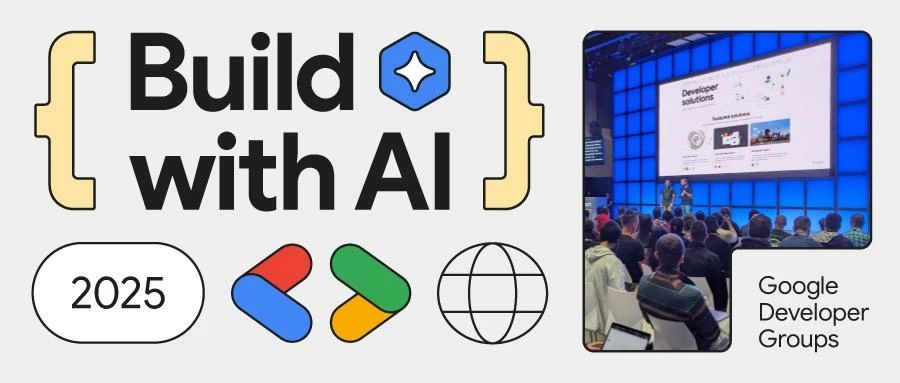

# Build with AI 2025 西安站报名

**Build with AI** 是由 Google 开发者社区（GDG）主导的全球性技术活动，旨在通过实践赋能开发者掌握生成式 AI 技术，探索谷歌最新模型工具（如 Gemini、Gemma 模型、Vertex AI、AI Studio 等）在跨行业的创新应用。

本次西安场 BwA 活动将于4月12日举行，将包含一个 AI 相关话题和一场 Codelab，期待大家报名参加。

## 活动话题

### AI编码助手到底能让软件交付快多少？

声称AI编码助手可以将交付速度提高 50% 是夸大其词。我们的测试表明，增幅更有可能是 10-15%。但这仍然是一个显著的增幅，而且考虑到市场上的 AI 编码助手的当前价格，性价比极高。

在讨论 AI 编码助手对软件交付团队的影响时，主要衡量指标是速度。虽然速度可能被称为生产力，但在大多数情况下，人们真正想表达的是“我们快了多少？”这就是为什么关于生产力提高的问题的预期答案通常是一个百分比值。然而，尽管行业炒作始于 50% 的生产力提高，但人们的想法似乎已经转向了另一个极端，人们谈论的是生产力完全没有提高，相反，错误率增加了 41%。 

虽然将生产力与速度等同起来肯定是有争议的，但我们不想在这里探讨这个问题。本次 Session 我们将专门研究 AI 编码助手如何提高速度。确实，速度本身可能很难确定；然而，在软件交付的背景下，我们拥有的速度的最佳代理变量是 Story Cycle Time。为了了解使用AI编码助手可以实现的周期时间改进的大致范围，我们在过去一年中一直在使用一种启发式方法：一种关于使用AI编码助手时团队收益的假设，并将其与我们从团队那里收到的数据和案例进行比较。本次 Session 我们将深入讨论这个话题，让您了解在什么场景下 AI 编码助手底能让软件交付快多少。

> **分享嘉宾：张思楚**，Thoughtworks 首席咨询师／离岸交付中心技术负责人。全栈工程师、畅销 Web 产品 SpreadWeb 架构师、海外大项目的离岸交付中心技术负责人(Technical Principal)， 3项 Web 专利技术发明人。敏捷软件管理、精益交付、持续交付专家。专注于系统平台的服务化、微服务的设计与实施。因为团队的不断快速扩张，对于团队快速构建、体系化 Coach、团队赋能、团队人才梯队构建、软件交付效能，有效实施持续集成和持续交付，落地合适的软件效能度量，帮助大型团队通过有效的效能度量和管理、保证团队稳定高效的交付积累了丰富经验。  
>  
> 

### BuildWithAI Codelab

Google AI Studio playground & API
- Gemini 2.0 Native Image Generation
- Gemma 3
- Gemini 2.0 Flash Thinking

**Codelab 具体细节待更新，完成挑战有纪念品可以领取哦！**

## 活动时间

2025年4月12日 周六 13:30 - 17:00

## 活动议程

13:30 - 14:00  活动签到
14:00 - 15:00  AI编码助手到底能让软件交付快多少？
15:00 - 15:10  合影、茶歇
15:10 - 16:40  Codelab（需自备电脑）
16:40 - 17:00  互动问答，交流学习

## 活动地点

丈八四路20号，西安神州数码科技园4栋一楼大厅电梯间南侧会议室。（地铁六号线，丈八四路站A口出）

**感谢泥巴创客空间提供免费场地**

## 报名方式

GDG 西安的活动均为免费活动，任何对开发感兴趣的朋友，都欢迎报名参加。

<https://www.wjx.top/vm/P70V7hc.aspx>

**活动包含 Codelab，如果要参加 Codelab 的部分，请记得携带笔记本电脑和充电器。**

## 主办方

活动由GDG西安主办，GDG西安成立于2012年8月4日，是一个专注于 Google 开发技术、开源技术的技术社区. 我们讨论的技术有 Android, Dart, Angular, Cloud Computing 等，开源技术一直是我们的最爱。

GDG西安是根植于西安的软件开发者社区，是 Google Developer Group Xi’an 的缩写，是谷歌开发者社区全球大家庭的一分子。我们每月会举行一次线下的开发者聚会，至2021年下半年，已举办100余次。

我们的活动主要形式是技术分享，由各位热心的社区成员，带给大家前沿的技术动向和深入的技术内容，也会不定期地举行 CodeLab 形式的活动，让大家在动手实践中学习和体会。

秉承着分享创新的精神，一切开放的技术：开源软件，开放技术标准等都是受欢迎的内容。一切技术从业者和爱好者都是我们欢迎的成员。如果你有意向分享知识与经验来展示自己，也可以报名成为我们的讲师，具体报名详情以及报名方法可以扫描下方二维码或者复制链接到浏览器打开

<https://jinshuju.net/f/EDndFr>

## 合作机构

