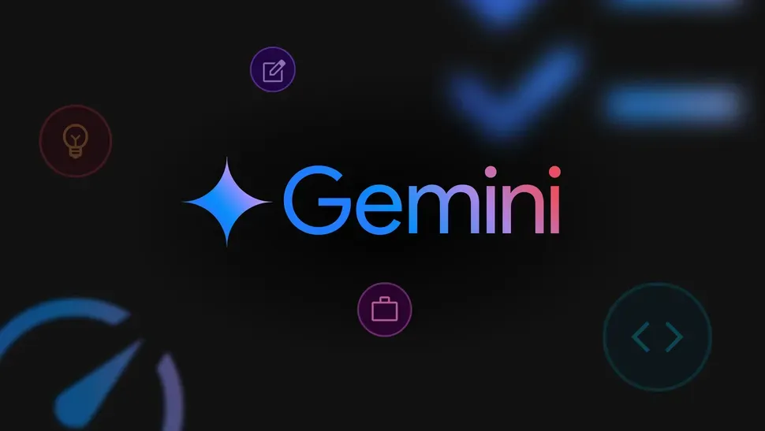

# Gemini API 编程工作坊：代码执行和AI音频回复 | GDG 西安

Gemini 是由 Google 开发的一款多模态生成式 AI 聊天机器人，它基于同名的大型语言模型，旨在理解和处理包括文本、图像、音频和视频在内的多种信息形式。这款AI被设计用于提供强大的推理能力，能够处理复杂的数据并发现深层联系；同时，它也具备出色的编码能力，支持多种编程语言并擅长解决编程挑战。此外，Gemini 在长文本理解方面表现突出，可以处理和分析大量的文字信息。

Gemini 深度集成到 Google 的各项产品和服务中，例如 Gmail、Google 文档和 Chrome 浏览器，以此帮助用户在工作、学习和日常生活中提高效率、激发创造力。Google 还推出了不同版本的 Gemini 模型，例如优化速度和成本效益的 Gemini 2.5 Flash 以及增强推理和多模态理解的 Gemini 2.5 Pro，以满足多样化的用户需求。

本次活动，我们准备了两个 Gemini 相关的 Colab，一起动手体验和学习一下 Gemini API 在代码执行和音频回复方面的能力。

## 活动话题

### Gemini API Codelab

本期 Gemini API Codelab 包含两个项目

#### 01. Gemini API：代码执行

Gemini API 的代码执行功能使模型能够根据您给出的纯文本指令生成并运行 Python 代码，甚至输出图表。它可以根据结果进行迭代学习，直至得出最终输出。

**GitHub 链接：**  
<https://github.com/google-gemini/cookbook/blob/main/quickstarts/Code_Execution.ipynb>

#### 02. Gemini API 多模态实时 API - 快速入门

借助 Gemini Multimodal Live API 实现了一个简单的会话聊天，你以文本形式发送消息，模型则以音频回复。

**GitHub 链接：**  
<https://github.com/google-gemini/cookbook/blob/main/quickstarts/Get_started_LiveAPI.ipynb>

### 指导老师

> **张思楚**，Thoughtworks 首席咨询师／离岸交付中心技术负责人。全栈工程师、畅销Web产品SpreadWeb架构师、海外大项目的离岸交付中心技术负责人(Technical Principal)，3项Web专利技术发明人。敏捷软件管理、精益交付、持续交付专家。专注于系统平台的服务化、微服务的设计与实施。因为团队的不断快速扩张，对于团队快速构建、体系化Coach、团队赋能、团队人才梯队构建、软件交付效能，有效实施持续集成和持续交付，落地合适的软件效能度量，帮助大型团队通过有效的效能度量和管理、保证团队稳定高效的交付积累了丰富经验。
>  
> 

### 注意事项

1. 请务必携带电脑参加，否则无法参加 Codelab，最好准备上充电器，我们会提供插排。
2. 请尽量提前注册 Google 账号以顺利使用 Google Colab，这是我们 Codelab 需要用到的工具。
3. 建议提前准备"高级"手机热点网络，避免现场人数太多Wi-Fi速度缓慢。

**Google Colab 链接：**  
<https://colab.research.google.com/>

## 活动时间

2025年6月14日 周六 13:30 - 17:00

## 活动地点

丈八四路20号，西安神州数码科技园4栋一楼大厅电梯间南侧会议室。（地铁六号线，丈八四路站A口出）

**感谢泥巴创客空间提供免费场地**

## 报名方式

GDG 西安的活动均为免费活动，任何对开发感兴趣的朋友，都欢迎报名参加。

<https://www.wjx.top/vm/P70V7hc.aspx>

**活动包含 Codelab，请记得携带笔记本电脑和充电器。**

## 主办方

活动由GDG西安主办，GDG西安成立于2012年8月4日，是一个专注于 Google 开发技术、开源技术的技术社区. 我们讨论的技术有 Android, Dart, Angular, Cloud Computing 等，开源技术一直是我们的最爱。

GDG西安是根植于西安的软件开发者社区，是 Google Developer Group Xi'an 的缩写，是谷歌开发者社区全球大家庭的一分子。我们每月会举行一次线下的开发者聚会，至2021年下半年，已举办100余次。

我们的活动主要形式是技术分享，由各位热心的社区成员，带给大家前沿的技术动向和深入的技术内容，也会不定期地举行 CodeLab 形式的活动，让大家在动手实践中学习和体会。

秉承着分享创新的精神，一切开放的技术：开源软件，开放技术标准等都是受欢迎的内容。一切技术从业者和爱好者都是我们欢迎的成员。如果你有意向分享知识与经验来展示自己，也可以报名成为我们的讲师，具体报名详情以及报名方法可以扫描下方二维码或者复制链接到浏览器打开

<https://jinshuju.net/f/EDndFr>

## 合作机构

