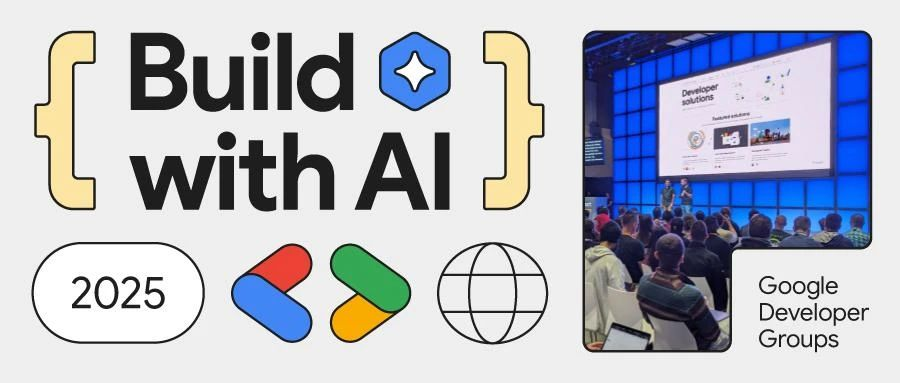

# I/O Extended 2025 西安站报名

**I/O Extended** 是由 Google 开发者社区（GDG）主导的全球性技术活动，旨在分享 Google I/O 大会的最新技术动态，探索谷歌最新产品、开发工具和技术趋势。

本次西安场 I/O Extended 2025 活动将于 7 月 6 日举行，我们将邀请多位技术专家，带来 Google I/O 2025 大会精彩内容的分享与技术解读，涵盖 AI、出海等前沿话题，并特别设置 AI Codelab 动手实践环节，欢迎开发者朋友们报名参加。

## 活动话题

### Google I/O 2025 Recap：Gemini 2.5 Pro、Gemini Live 与 AI 工具新生态

2025 年 Google I/O 以「Turning forward-looking research into reality」为主题，聚焦「AI-First for Everyone, Everywhere」战略，正式发布 Gemini 2.5 Pro、Gemini Live、Veo 3、AI 模式搜索等超过 100 项新功能。Android 16 与 ML Kit GenAI API 将生成式 AI 普及至每一台设备，Google Cloud、Workspace 与 Beam 3D 等平台全面升级了面向开发者的工具与 API。本场 Recap 将用 40 分钟快速回顾所有核心亮点，展示 Google 最新 AI 能力如何赋能开发者生态，帮助你更快上手实践。

> **分享嘉宾：Frederick Griffith**，数据科学专业本科生，专注于机器学习、算法设计与生成式 AI 的理论研究。热衷于社区交流与分享，致力于推动前沿技术的落地实践。
>
> 

### 理性使用 AI 编程助手

本次分享将探讨如何理性、安全地使用 AI coding agent，提升开发效率的同时，有效规避潜在风险。帮助大家在日常工作中更安心地应用 AI 编程助手。

> **分享嘉宾：潘睿（Perry）**，在咖啡馆工作的软件工程师。
>
> 

### 动手实践：Google 新技术体验

在本环节中，我们将通过实际操作和互动演示，帮助开发者快速上手 Google I/O 2025 发布的新工具和 API。内容包括：

- Google AI 最新工具与 API 实践
- Android/Flutter 新特性实战演示
- Cloud 开发者工具实操体验

> **指导老师：待公布**

**（具体议程与嘉宾信息将持续更新，敬请关注！）**

### AI Codelab 动手实践

本环节将带来基于 Google 最新 AI 技术的 Codelab 实践，参与者可在指导下动手体验 AI 应用开发流程，深入理解模型调用、数据处理与部署等关键环节。

- 现场分组，动手完成指定 AI Codelab 任务
- 体验 Gemini API、Vertex AI 等最新工具
- 导师现场答疑与技术指导

> **Codelab 导师：待公布**

## 活动时间

2025年7月6日 周日 13:30 - 17:00

## 活动议程

13:30 - 14:00  活动签到
14:00 - 14:45  Google I/O 2025 精彩回顾与技术解读
14:45 - 15:30  理性使用 AI 编程助手
15:30 - 15:45  合影、茶歇
15:45 - 16:40  动手实践：Google 新技术体验
16:40 - 17:00  互动问答，交流学习

## 活动地点

丈八四路20号，西安神州数码科技园4栋一楼大厅电梯间南侧会议室。（地铁六号线，丈八四路站A口出）

**感谢泥巴创客空间提供免费场地**

## 报名方式

GDG 西安的活动均为免费活动，任何对开发感兴趣的朋友，都欢迎报名参加。

<https://www.wjx.top/vm/P70V7hc.aspx>

**活动包含动手实践环节，如果要参加该部分，请记得携带笔记本电脑和充电器。**

## 主办方

活动由GDG西安主办，GDG西安成立于2012年8月4日，是一个专注于 Google 开发技术、开源技术的技术社区。我们讨论的技术有 Android, Dart, Angular, Cloud Computing 等，开源技术一直是我们的最爱。

GDG西安是根植于西安的软件开发者社区，是 Google Developer Group Xi’an 的缩写，是谷歌开发者社区全球大家庭的一分子。我们每月会举行一次线下的开发者聚会，至2021年下半年，已举办100余次。

我们的活动主要形式是技术分享，由各位热心的社区成员，带给大家前沿的技术动向和深入的技术内容，也会不定期地举行 CodeLab 形式的活动，让大家在动手实践中学习和体会。

秉承着分享创新的精神，一切开放的技术：开源软件，开放技术标准等都是受欢迎的内容。一切技术从业者和爱好者都是我们欢迎的成员。如果你有意向分享知识与经验来展示自己，也可以报名成为我们的讲师，具体报名详情以及报名方法可以扫描下方二维码或者复制链接到浏览器打开

<https://jinshuju.net/f/EDndFr>

## 合作机构

