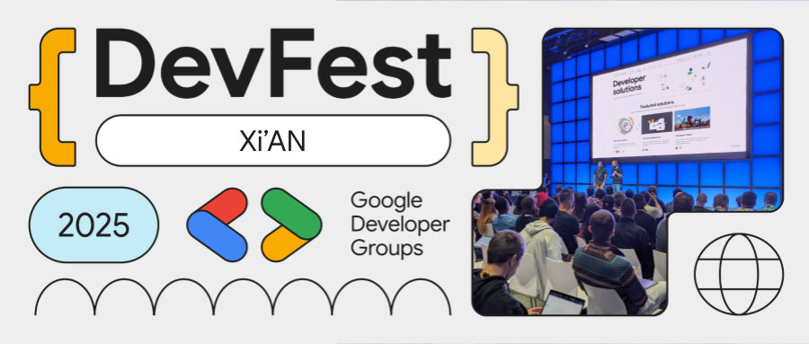
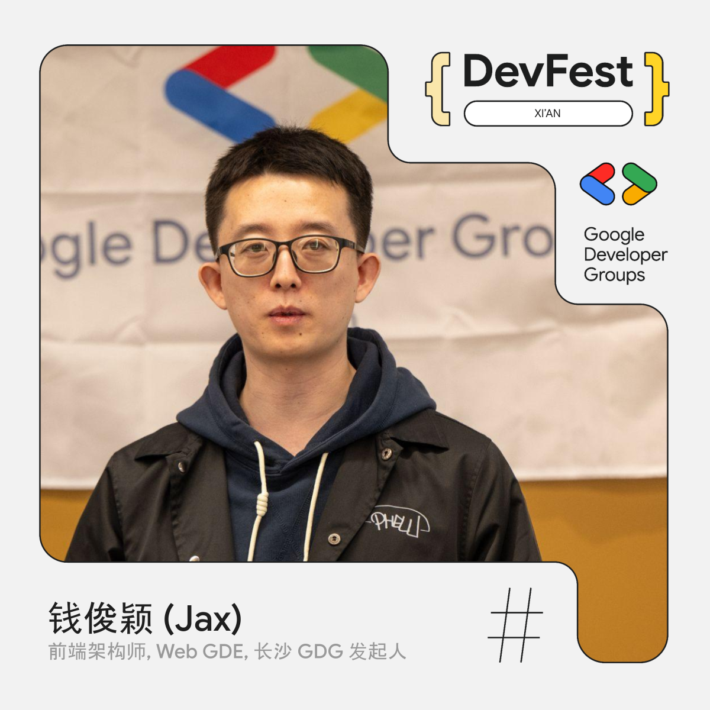
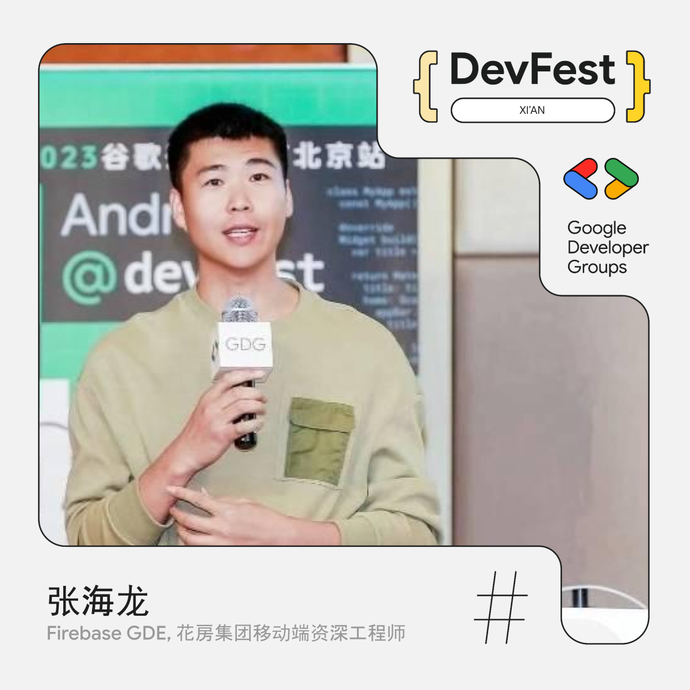
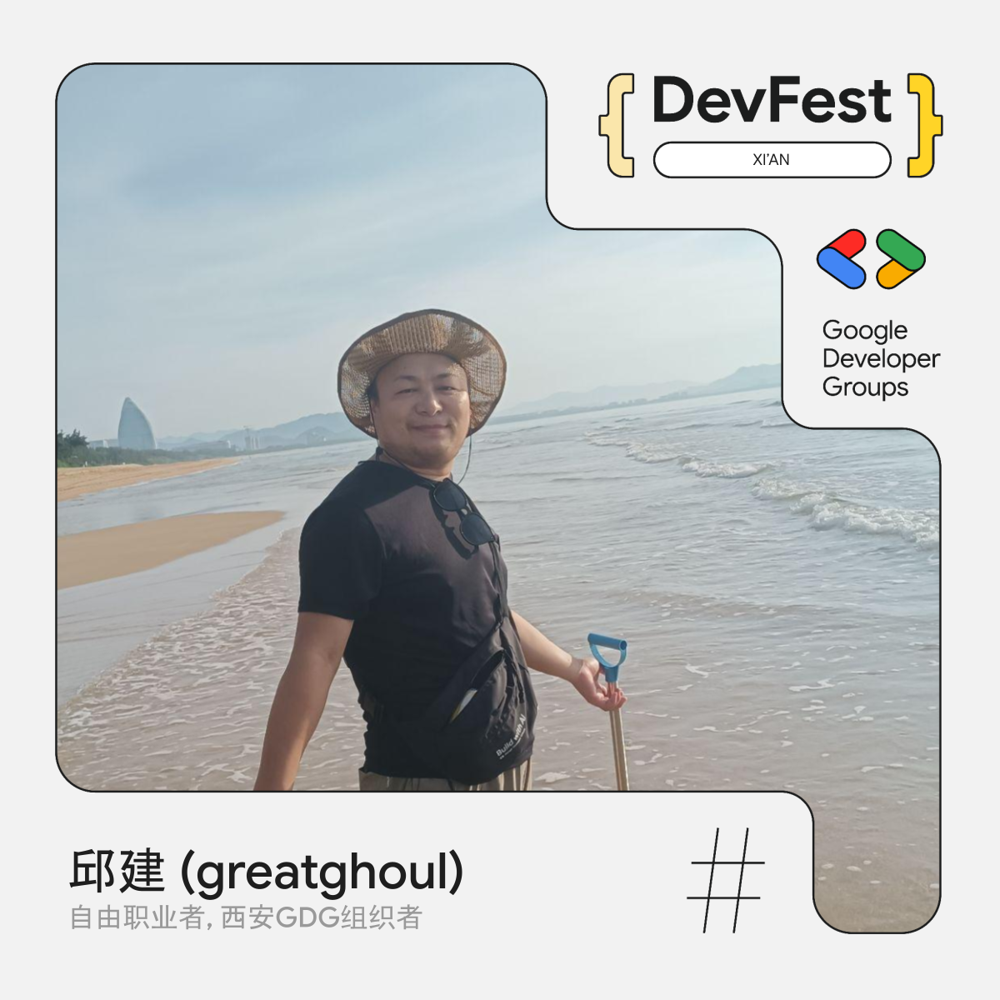
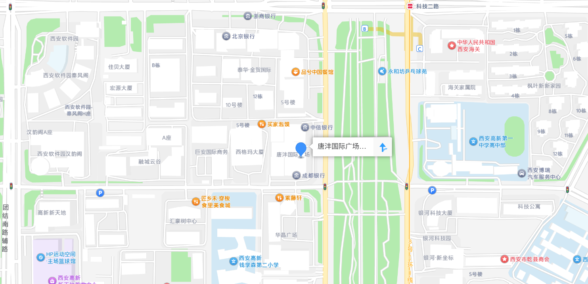
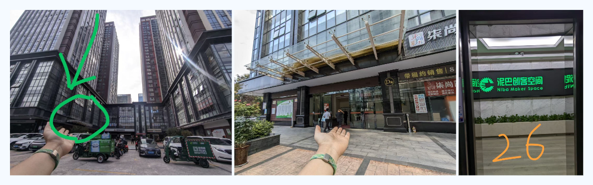
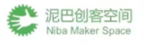

# DevFest 2025 西安站报名 | GDG 西安

GDG DevFest 是由 Google 开发者社区（GDG）在全球范围内主办的年度开发者盛会，内容覆盖 Android、Web、Cloud、AI 等多个技术方向。本次 DevFest 2025 西安站将带来关于 Chrome DevTools 智能调试、App出海实战、AI 等方向的两场主题分享与一场动手实践 Codelab，欢迎开发者朋友报名参加。

## 活动话题

### Chrome DevTools 智能版，更聪明的调试伴侣

本次分享将介绍 Chrome DevTools 中的 AI 调试助手以及 MCP Server 的能力，帮助开发者提升调试效率。内容包括：

1.  介绍 Chrome DevTools 里的智能调试工具（AI Assistance 等），它们的功能、解锁方式和最佳实践。
2.  介绍 DevTools MCP Server 的能力、使用方式和底层原理。

> **分享嘉宾：钱俊颖（Jax）**，前端架构师、Web 谷歌开发者专家、长沙谷歌开发者社区发起人，致力于推广 Web AI 的普及、应用和标准化。

### App出海实战：从0到全球

本次分享将从全球移动应用出海趋势出发，对比国内与海外在开发生态、发布流程与运营模式上的核心差异，并结合真实项目经验拆解完整出海路径。主要内容包括：

1. Google Play 与国内应用商店的生态差异
   分发机制、审核策略、版本管理、隐私政策与合规要求
2. Firebase 在出海过程中的关键能力
   分析统计、消息推送、崩溃监控、A/B 测试、远程配置等
3. 常用出海第三方 SDK 选型与集成
   数据统计、支付、广告变现、合规与本地化服务
4. 从 0 到上线的出海实操流程
   包体配置、签名发布、多端适配、合规审核、版本迭代
5. 海外市场的变现模式与策略拆解
   内购（IAP）、订阅、广告、混合模式、LTV 与投放联动

通过案例讲解与技术拆解，帮助开发者全面理解"开发—发布—运营—变现"的出海全流程，实现产品从本地市场走向全球用户与全球收入。

> **分享嘉宾：张海龙**，花房集团移动端资深工程师，Firebase GDE，CSDN博主，有丰富的海外项目经验

### 构建您的首个 AI 伴侣：初学者研讨会

本环节将带领参与者从零开始构建一个功能齐全的AI伴侣应用。这不仅仅是一个简单的聊天机器人，而是一个具有个性、能够获取实时信息并拥有自定义外观的交互式数字伴侣。参与者将通过实践学习如何：

1. 使用 Gemini CLI 生成完整的 ADK 代理配置
2. 通过改进指令来增强智能体的个性
3. 为代理添加"依据"，使其能够回答关于近期活动的问题
4. 使用具有 Imagen 的 MCP 服务器为随播广告生成自定义头像

在本次工作坊中，您将从一个预构建的Web应用开始，逐步添加智能和自定义层，将简单的数字"傀儡"转变为独特而强大的AI伙伴。

**Codelab 链接：** [构建您的首个 AI 伴侣：初学者研讨会](https://codelabs.developers.google.com/companion-adk-beginner/instructions?hl=zh-cn#0)

> **Codelab 导师：邱建 (greatghoul)**，Web全栈工程师，自由职业者，GDG西安组织者。

**注意事项：**

- 请务必携带电脑参加，否则无法参加 Codelab，最好准备好充电器，我们会提供插排
- 请务必使用个人 Gmail 账号参加，公司或学校管理的账号将无法使用
- 建议在 Chrome 浏览器中使用无痕模式，以避免账号冲突
- 活动将提供 Google Cloud Platform 平台赠金用于使用付费服务，我们将在活动开始前告知相关信息
- 建议提前准备"国际网络环境"，避免现场人数太多 Wi‑Fi 速度变慢

## 活动时间

2025年11月15日 周六 13:30 - 17:00

## 活动议程

| 时间 | 活动内容 |
|------|----------|
| 13:30 - 14:00 | 活动签到 |
| 14:00 - 14:45 | Chrome DevTools 智能版，更聪明的调试伴侣 |
| 14:45 - 14:55 | 合影、茶歇 |
| 14:55 - 15:40 | App出海实战：从0到全球 |
| 15:40 - 15:50 | 茶歇 |
| 15:50 - 16:50 | Codelab: 构建您的首个 AI 伴侣：初学者研讨会 |
| 16:50 - 17:00 | 自由交流 |

## 活动地点

西安市高新区沣惠南路18号唐沣国际D座26楼泥巴创客空间 ([使用高德地图打开](https://www.amap.com/place/B0FFF5V3J0))

**感谢泥巴创客空间提供免费场地**

## 报名方式

GDG 西安的活动均为免费活动，任何对开发感兴趣的朋友，都欢迎报名参加。

<https://www.wjx.top/vm/P70V7hc.aspx>

**活动包含 Codelab，如需参加该环节，请记得携带笔记本电脑和充电器。**

## 主办方

活动由GDG西安主办，GDG西安成立于2012年8月4日，是一个专注于 Google 开发技术、开源技术的技术社区。我们讨论的技术有 Android, Dart, Angular, Cloud Computing 等，开源技术一直是我们的最爱。

GDG西安是根植于西安的软件开发者社区，是 Google Developer Group Xi’an 的缩写，是谷歌开发者社区全球大家庭的一分子。我们每月会举行一次线下的开发者聚会，至2021年下半年，已举办100余次。

我们的活动主要形式是技术分享，由各位热心的社区成员，带给大家前沿的技术动向和深入的技术内容，也会不定期地举行 CodeLab 形式的活动，让大家在动手实践中学习和体会。

秉承着分享创新的精神，一切开源的技术：开源软件，开放技术标准等都是受欢迎的内容。一切技术从业者和爱好者都是我们欢迎的成员。如果你有意向分享知识与经验来展示自己，也可以报名成为我们的讲师，具体报名详情以及报名方法可以扫描下方二维码或者复制链接到浏览器打开

<https://jinshuju.net/f/EDndFr>

## 合作机构

