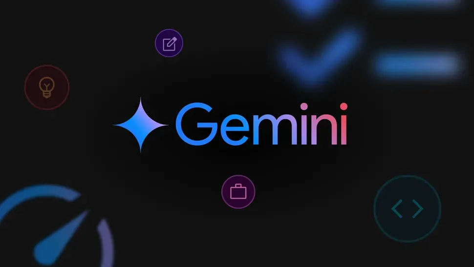

# AI 助力系统迁移以及 AI 加持的 Flutter 颜色描述应用 Codelab | GDG 西安

本次活动我们将聚焦于 AI 在实际工程中的应用。首先，来自 Thoughtworks 的技术专家张思楚将分享
如何利用 AI Agent 和知识库解决遗留系统迁移的难题。随后，我们将进行一场动手实践 Codelab，
由刘信带领大家构建一个由 Gemini 提供支持的 Flutter 颜色描述应用。

## 活动话题

### 用 AI Agent 与知识库重塑遗留系统迁移范式

本议题将深入剖析一个极具代表性的企业难题：如何高效、高质量地将一个运营超过 20 年的 CMS 系统迁移至新平台。
当原始代码和数据库已成“黑盒”且无法读取时，传统的 ETL(抽取 - 转换 - 加载) 工具和人工平移方法将面临巨大挑战，
不仅效率低下，且难以实现内容的结构化与美化升级。

针对这一痛点，本演讲将提出一个基于前沿大语言模型 (LLM) 驱动的创新解决方案。
我们利用 Langflow 作为可视化的 AI 工作流编排中枢，串联起多个 Agent 与外部工具 MCP，
构建了一个端到端的内容迁移自动化流水线。

> **分享嘉宾：张思楚**，Thoughtworks Technical Principal

### Codelab: 构建由 Gemini 提供支持的 Flutter 应用

在此 Codelab 中，您将构建 Colorist，这是一个交互式 Flutter 应用，可将 Gemini API 的强大功能直接引入您的 Flutter 应用。
借助 Colorist，用户可以使用自然语言描述颜色（例如“日落的橙色”或“深海蓝”），然后该应用会使用 Google 的 Gemini API 
处理这些说明，将说明解读为精确的 RGB 颜色值，并实时显示屏幕上的颜色。

**学习内容：**

- 为 Flutter 应用配置 Firebase AI Logic
- 撰写有效的系统提示，引导 LLM 的行为
- 实现连接自然语言和应用功能的函数声明
- 处理流式响应，打造响应迅速的用户体验
- 在界面事件和 LLM 之间同步状态

> **分享嘉宾：刘信**

**Codelab 注意事项：**

- 请务必携带笔记本电脑及充电器。
- 建议提前准备好“国际网络环境”，以确保顺利访问所需服务。
- 为保证 Codelab 效果，请确保您的设备已安装
  [Flutter](https://flutter.cn/docs/get-started/install) 和顺手的代码编辑器 (如
  [VS Code](https://code.visualstudio.com/) 或
  [Android Studio](https://developer.android.com/studio))。

## 活动安排

| 时间          | 内容                                                  |
| ------------- | ----------------------------------------------------- |
| 13:30 - 14:00 | 签到                                                  |
| 14:00 - 14:10 | 开场介绍                                              |
| 14:10 - 15:00 | 用 AI Agent 与知识库重塑遗留系统迁移范式 (张思楚)     |
| 15:00 - 15:20 | 合影 & 茶歇                                           |
| 15:20 - 17:10 | Codelab: 构建由 Gemini 提供支持的 Flutter 应用 (刘信) |
| 17:10 - 17:30 | 自由交流                                              |

## 活动时间与地点

- **时间：** 2025年12月27日 星期六 13:30 - 17:30
- **地点：**
  西安市高新区沣惠南路18号唐沣国际D座26楼 泥巴创客空间 ([高德地图](https://www.amap.com/place/B0FFF5V3J0))

## 报名方式

活动免费，但因场地有限，需报名参加。

<https://www.wjx.top/vm/P70V7hc.aspx>

## 关于我们

**主办方**

GDG 西安成立于2012年8月4日，是一个专注于 Google 开发技术、开源技术的非营利性技术社区。
我们讨论的技术包括 Android, Flutter, Web, Go, AI/ML, Cloud Computing 等。
我们每月会举行一次线下的开发者聚会，至2025年，已举办100余次。

**成为讲师**

如果你有意向分享知识与经验，欢迎报名成为我们的讲师。

<https://jinshuju.net/f/EDndFr>

## 合作伙伴

