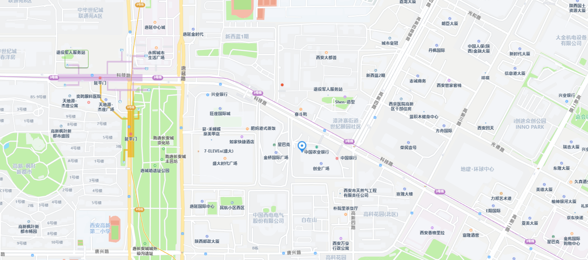
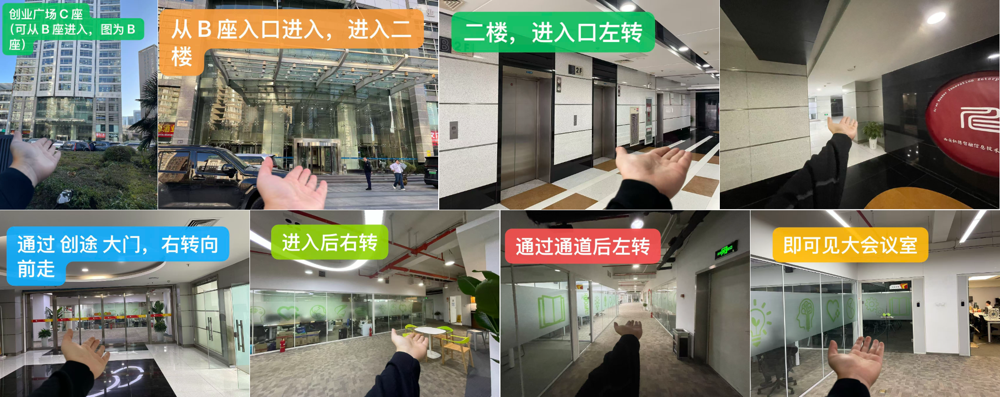
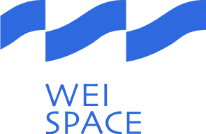

# Build with AI 2026 西安站报名

**Build with AI** 是由 Google 开发者社区（GDG）主导的全球性技术活动，旨在通过动手实践帮助开发者理解和掌握最新的生成式 AI 工具、模型能力与应用开发方式。

本次西安场 Build with AI 2026 将于 4 月 18 日举行，活动时间为 13:30 - 17:30。本次活动不设主题分享，整体以 Codelab 实践为主，内容围绕 Google AI Studio、Vertex AI、Gemini API、Google Gen AI SDK 以及 Google Antigravity 展开。

活动将分为入门和中级两个实践级别。参与者将结合自己的兴趣与经验，在每个级别的两个题目中各选择一个完成，分别体验 AI 应用生成、图像生成与编辑、视频内容摘要，以及代理式应用构建等方向。

## 活动内容

### Build with AI Codelab 实践

本次活动分为入门和中级两个实践级别，每个级别各提供两个题目。参与者需要完成入门和中级两个级别的练习，并根据自己的兴趣和经验，在每个级别中选择其中一个题目完成。

#### 入门

1. [在 Google AI Studio 中使用 Gemini 进行氛围编程](https://codelabs.developers.google.com/vibe-code-with-gemini-in-aistudio?hl=zh-cn#0)

	使用 Google AI Studio 的构建模式生成并迭代一个结合音乐播放器与贪吃蛇游戏的 React Web 应用，体验从提示构建、效果优化，到保存到 GitHub 并部署到 Cloud Run 的完整流程。

2. [Gemini 3.1 Flash Image (Nano Banana 2 🍌) Generation on Vertex AI](https://github.com/GoogleCloudPlatform/generative-ai/blob/main/gemini/getting-started/intro_gemini_3_1_flash_image_gen.ipynb)

	通过 Vertex AI 与 Google Gen AI SDK 体验 Gemini 3.1 Flash Image 的 Notebook 实践，学习文生图、模型思考过程展示、人物过滤、基于搜索的 grounding，以及多轮图像编辑等核心能力。

#### 中级

1. [构建一个依托 Gemini 的 YouTube 摘要器](https://codelabs.developers.google.com/devsite/codelabs/build-youtube-summarizer?hl=zh_cn#1)

	使用 Python Flask、Gemini API 和 Google Gen AI SDK 构建一个 YouTube 摘要 Web 应用，支持输入视频链接、选择模型并生成摘要，最后部署到 Cloud Run。

2. [使用 Google Antigravity 构建应用](https://codelabs.developers.google.com/building-with-google-antigravity?hl=zh-cn#4)

	使用 Google Antigravity 的 Agent Manager 生成并迭代一个番茄钟效率应用，体验代理拆解任务、生成界面、调用浏览器进行测试，以及通过后续提示继续完善样式和图片内容的工作流。

注意事项：

1. 请务必携带电脑参加，最好准备上充电器，我们会提供插排
2. 请务必提前注册 Gmail 邮箱账号做使用准备，将用于使用相关服务以及领取 Cloud Credit
3. 建议提前准备手机热点网络，避免现场人数太多 Wi-Fi 速度缓慢

**（活动细节仍在持续完善中，完成挑战后将有纪念品发放。）**

## 活动议程

13:30 - 14:00  活动签到
14:00 - 14:20  活动开场、流程介绍
14:20 - 14:30  合影、茶歇
14:30 - 15:30  入门 Codelab（两题选一）
15:30 - 17:10  中级 Codelab（两题选一）
17:10 - 17:30  互动问答，交流学习

## 活动时间与地点

- **时间：** 2026年4月18日 星期六 13:30 - 17:30
- **地点：** 陕西省西安市雁塔区科技路48号创业广场c座2层 创途在XIAN  
 　　　 [使用高德地图打开](https://surl.amap.com/cyhfPaxu22e)

**感谢 WEI SPACE人工智能孵化器提供免费场地**

## 报名方式

GDG 西安的活动均为免费活动，任何对开发感兴趣的朋友，都欢迎报名参加。

<https://www.wjx.top/vm/P70V7hc.aspx>

**本次活动以 Codelab 实践为主，参与者需要完成入门和中级两个级别，并在每个级别的两个题目中各选择一个完成，请记得携带笔记本电脑和充电器。**

## 主办方

活动由 GDG 西安主办。GDG 西安成立于 2012 年 8 月 4 日，是一个专注于 Google 开发技术、开源技术的技术社区。我们讨论的技术有 Android、Dart、Angular、Cloud Computing 等，开源技术一直是我们的最爱。

GDG 西安是根植于西安的软件开发者社区，是 Google Developer Group Xi'an 的缩写，是谷歌开发者社区全球大家庭的一分子。我们每月会举行一次线下的开发者聚会。

我们的活动主要形式是技术分享，由各位热心的社区成员带来前沿的技术动向和深入的技术内容，也会不定期举行 CodeLab 形式的活动，让大家在动手实践中学习和体会。

秉承着分享创新的精神，一切开放的技术：开源软件、开放技术标准等都是受欢迎的内容。一切技术从业者和爱好者都是我们欢迎的成员。如果你有意向分享知识与经验来展示自己，也可以报名成为我们的讲师，具体报名详情以及报名方法可以扫描下方二维码或者复制链接到浏览器打开。

<https://jinshuju.net/f/EDndFr>

## 合作伙伴

WEI SPACE人工智能孵化器

